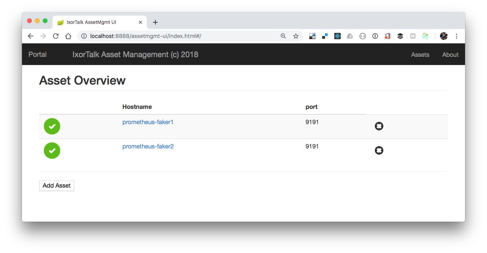
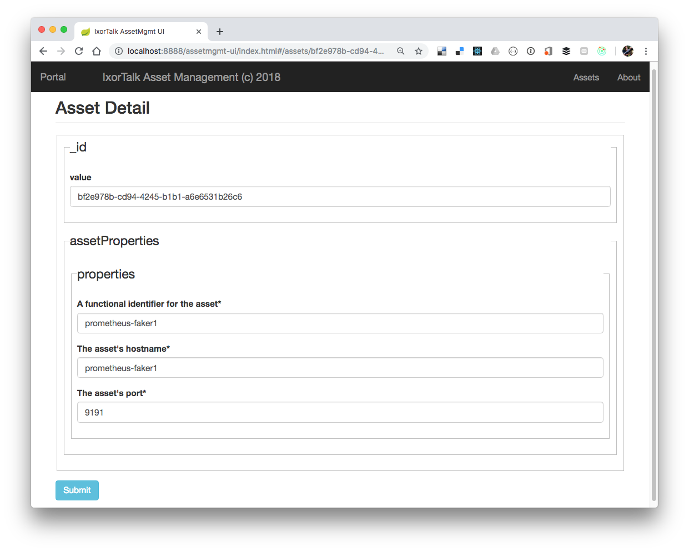
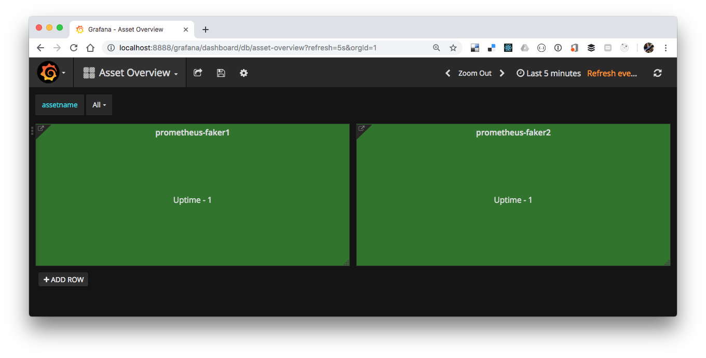
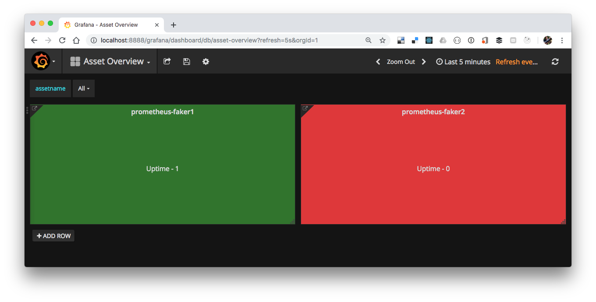
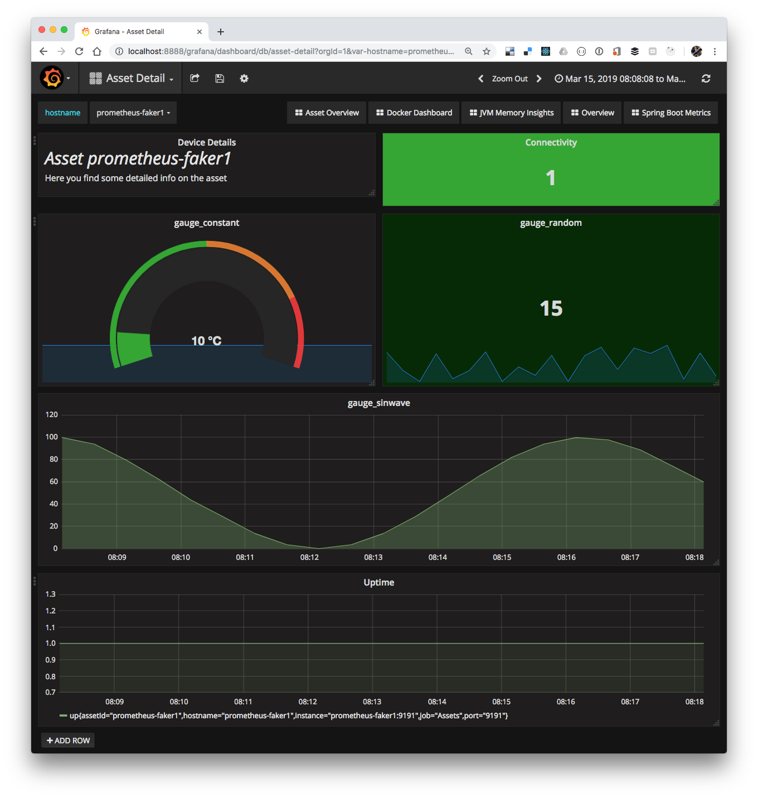

# Introduction

This is module implements a random / fake metric generator for Prometheus.
It can be configured through the ixortalk config server to generate metric values based on different value generators.
The faker can be configured at runtime.

# Value Generators

The faker supports a number of value generators that can be attached to Prometheus metrics.

- ConstantValueGenerator (generates a constract value for the given metric)
- SinWaveValueGenerator (generates a sin wave value for the given metric)
- RandomValueGenerator (generates a random value for the given metric)

# Configuration 

A typical configuration file looks like this :
```
{
  "metrics": {
    "gauge_constant": {
      "enabled": true,
      "type": "ConstantValueGenerator",
      "props": {
        "interval": 1,
        "constantValue": 10
      }
    },
    "gauge_sinwave": {
      "enabled": true,
      "type": "SinWaveValueGenerator",
      "props": {
        "interval": 1
      }
    },
    "gauge_random": {
      "enabled": true,
      "type": "RandomValueGenerator",
      "props": {
        "from": 1,
        "to": 100
      }
    }
  }
}
```

and is stored in the ixortalk.config.server project in the `ixortalk.prometheus.faker` folder.


## IxorTalk integration

### Docker compose

You can add the fakers to your stack by using docker compose. By specifying a hostname, we can ensure that the fakers can be called by that name, as

```
  prometheus-faker1:
    image: ixortalk/ixortalk.prometheus.faker:${IXORTALK_PROMETHEUS_FAKER_VERSION:-latest}
    hostname: prometheus-faker1
    depends_on:
      ixortalk-config-server:
        condition: service_healthy

  prometheus-faker2:
    image: ixortalk/ixortalk.prometheus.faker:${IXORTALK_PROMETHEUS_FAKER_VERSION:-latest}
    hostname: prometheus-faker2
    depends_on:
      ixortalk-config-server:
        condition: service_healthy
```

### Container startup - asset creation 

Upon starting, the container will create an asset in asset management (if one does not exist) using the following properties.

```
{
    "assetId": "0494a790-51f7-4528-a113-654735d4a24d",
    "assetProperties": {
        "properties": {
            "assetId": "prometheus-faker1",
            "hostname": "prometheus-faker1",
            "port": 9191
        }
    },
    "children": [],
    "roles": [],
    "_links": {
        "self": {
            "href": "http://localhost:8888/assetmgmt/assets/0494a790-51f7-4528-a113-654735d4a24d"
        },
        "asset": {
            "href": "http://localhost:8888/assetmgmt/assets/0494a790-51f7-4528-a113-654735d4a24d"
        }
    }
}
```

### Asset Management 
These assets can also be found in the [Assetmgmt ui application](http://localhost:8888/assetmgmt-ui)



And its details can be found at 



### Grafana

2 Grafana dashboards are also provided

#### Grafana overview

The [grafana overview dashboard](http://localhost:8888/grafana/dashboard/db/asset-overview?refresh=5s&orgId=1) shows you the different assets and give an indication of their uptime :



Stopping one of the fakers

```
docker-compose stop prometheus-faker2
Stopping demo_prometheus-faker2_1 ... done
```

Will result in one of the assets becoming red, as it is no longer being detected prometheus


 
From the overview dashboard we can also see its details, showing the individual metrics  




## Prometheus endpoint

When started, a prometheus endpoint will be made available at `http://prometheus-faker1:9191/prometheus`

## Updating the configuration

You can update runtime configuration like this :
```
curl -v -X POST -d '{"enabled": true,"type": "ConstantValueGenerator","metric_name": "gauge_metro_getSICPPlatformVersion","props": {"interval": 1,"constantValue": 2}}' http://localhost:9191/updateconfig/gauge_xxx
curl -X POST -H "Content-Type: application/json" -d '{"enabled": false,"type": "SinWaveValueGenerator","props": {"interval": 1}}' http://localhost:9191/updateconfig/gauge_xxx
```

But be aware that this won't persist the configuration. So on next startup it will again read the configuration from the config server.
 
 
 
